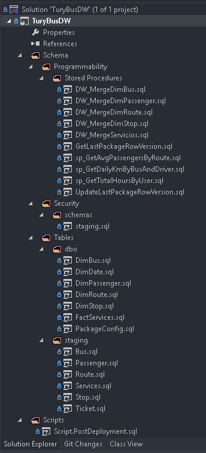
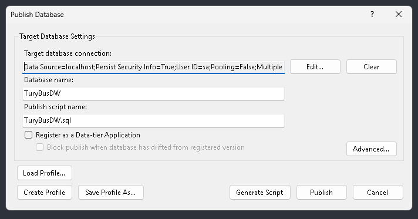
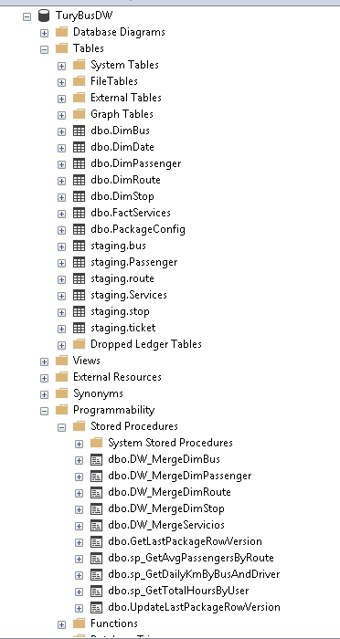

# 📄 II. Proyecto TuryBusDW

## 🚀 Pasos de Configuración

1. En Visual Studio, abra la solución `TuryBusDW.sln`.

2. Desde el **Explorador de Soluciones**, haga clic derecho sobre el proyecto **TuryBusDW** y seleccione `Build` para compilarlo.
3. Haga clic derecho sobre el nombre del proyecto y seleccione `Publish`.
4. En la ventana emergente:
    - Seleccione la conexión a **SQL Server**.
    - Escriba el nombre de la base de datos: `TuryBusDW`.
    - Defina el script de publicación: `TuryBusDW.sql`.
    - Haga clic en `Publish`.

5. Verifique en SQL Server Management Studio (SSMS):
    - Asegúrese de que la base de datos `TuryBusDW` haya sido creada.
    - Verifique que las tablas hayan sido creadas correctamente.
    - Confirme que los procedimientos almacenados hayan sido creados correctamente.

[**◀ Volver al README**](README.md)