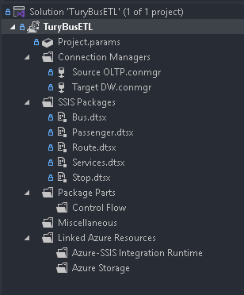
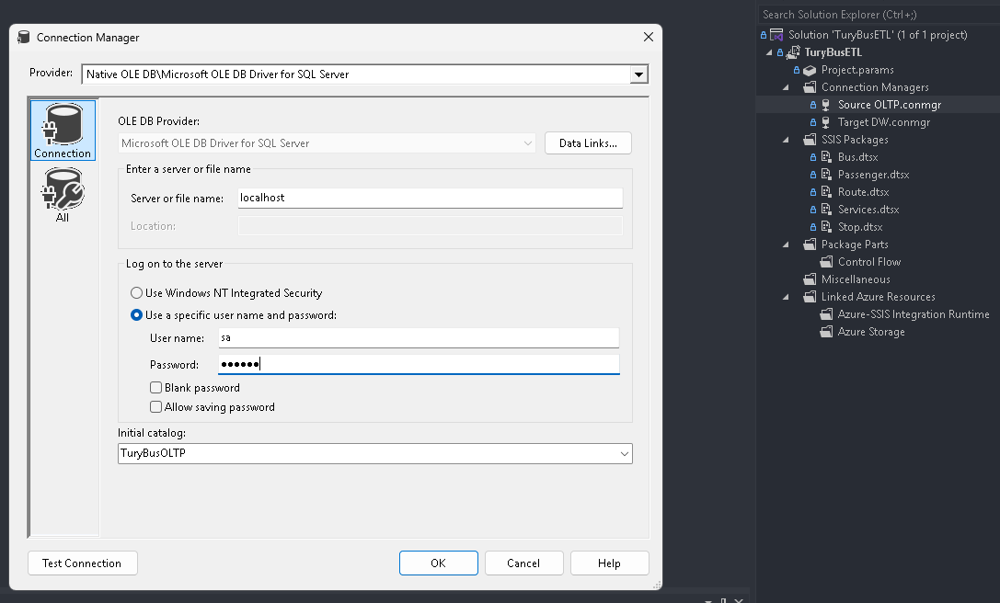
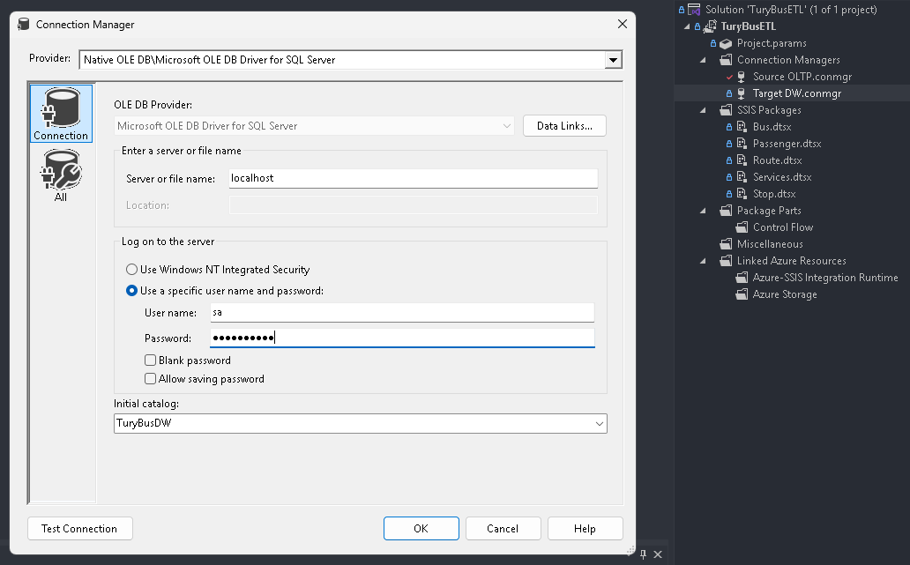
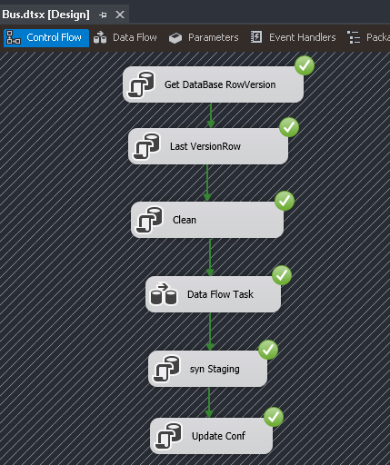
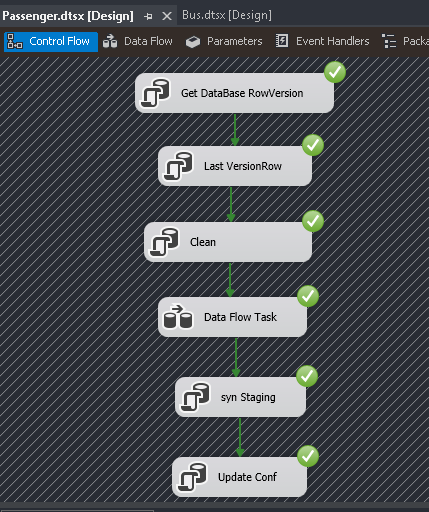
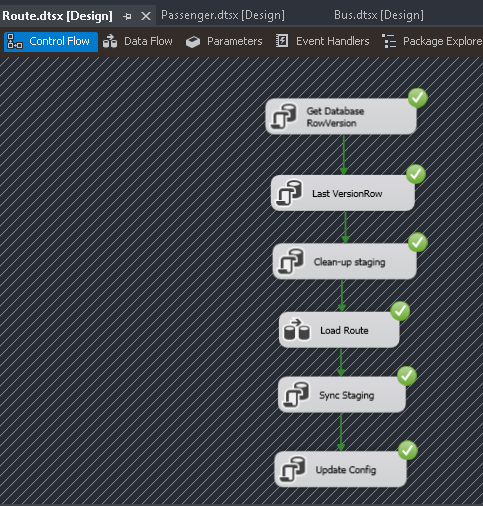
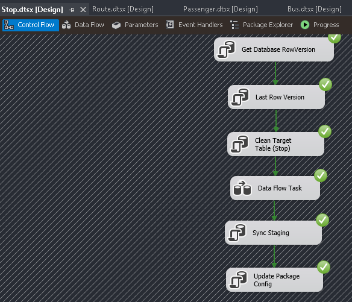
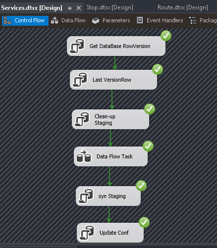
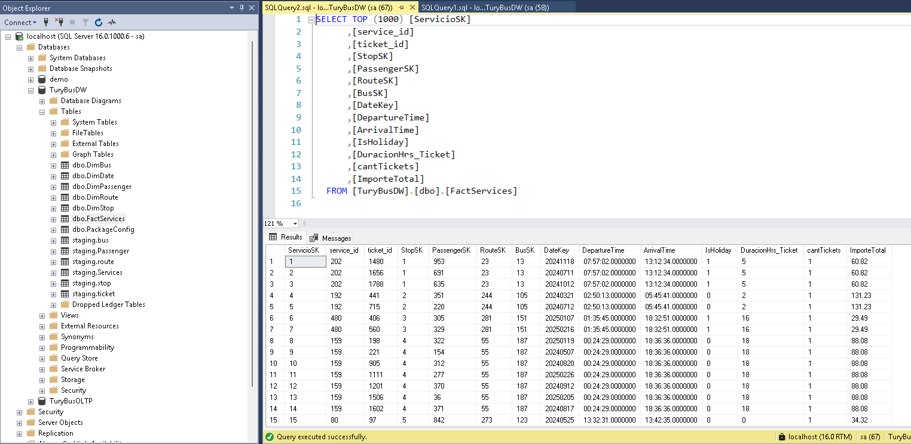

# 📄 III. Proyecto TuryBusETL

## 🚀 Pasos de Configuración

1. En Visual Studio, abra la solución `TuryBusETL.sln`.

2. Desde el **Explorador de Soluciones**, haga clic derecho sobre el proyecto **TuryBusETL** y seleccione `Build`.

### Configuración de las conexiones Source y Target

1. Desde el **Explorador de Soluciones**, en la sección `Connection Manager`, haga doble clic sobre `Source OLTP.conmgr` y edite los valores de conexión a la base de datos local.

2. Realice el mismo proceso con `Target DW.conmgr`.

### Ejecución de los paquetes SSIS

1. Abra los siguientes paquetes desde `SSIS Packages` en el **Explorador de Soluciones**:
   - `Bus.dtsx`
   - `Passenger.dtsx`
   - `Route.dtsx`
   - `Services.dtsx`
   - `Stop.dtsx`
2. Ejecute cada paquete individualmente haciendo clic en `Start` en la barra superior de **Visual Studio**.

### Verificación en SQL Server Management Studio (SSMS)

- Asegúrese de que las **tablas de dimensiones** (Dim tables) fueron pobladas correctamente.
- Verifique que la **tabla de hechos** (Fact table) fue poblada correctamente.

[**◀ Volver al README**](README.md)