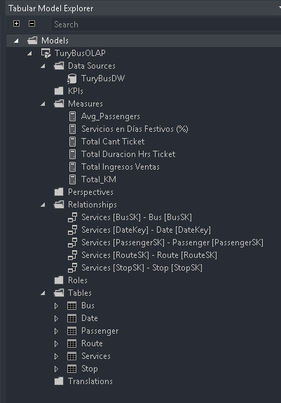
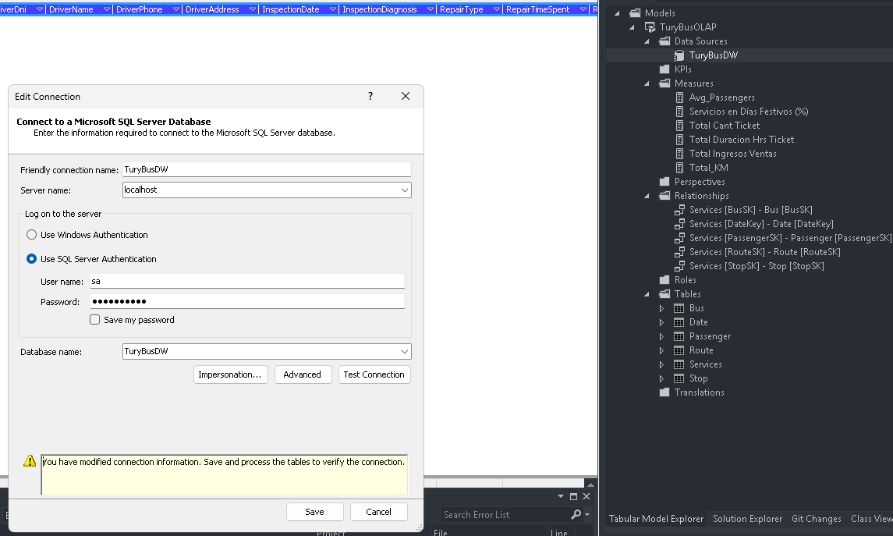

# 📄 V. Proyecto TuryBusOLAP

## 🚀 Pasos de Configuración

1. Asegúrese de tener instalado **Analysis Services**.
2. Abra la solución `TuryBusOLAP.sln`.

3. Configure la conexión al servidor del espacio de trabajo:
   - Cuando aparezca la ventana de configuración, ingrese `localhost`.
   - Haga clic en `Test Connection` y asegúrese de que la conexión funcione.

4. Desde el **Explorador de Soluciones**, abra el archivo `TuryBusOLAP.bim`.

*(Continuar con los siguientes pasos de configuración y despliegue...)*

[**◀ Volver al README**](README.md)