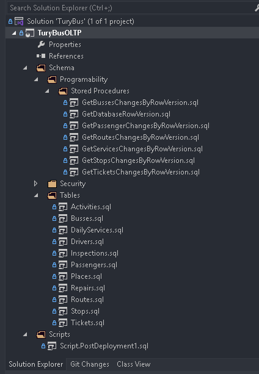
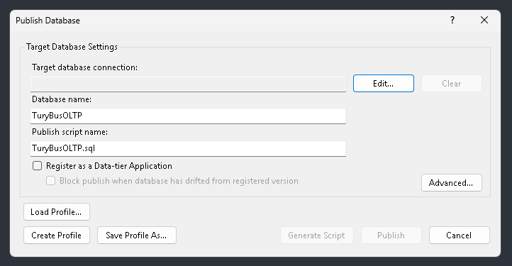
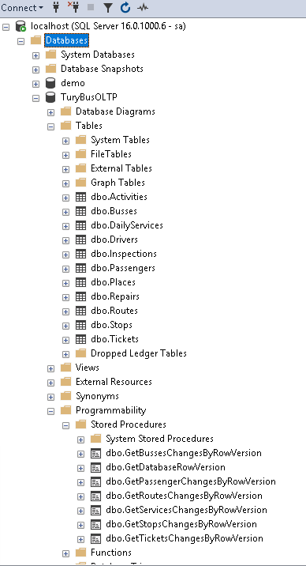

# 📄 I. Proyecto TuryBusOLTP

## 🚀 Pasos de Configuración

1. Vaya a `File > Open > Project/Solution` y seleccione la carpeta del repositorio del proyecto.
2. Abra la solución `TuryBus.sln`.
3. Desde el **Explorador de Soluciones**, haga clic derecho sobre el proyecto **TuryBusOLTP** y seleccione `Build` para compilar el proyecto.

4. Haga clic derecho sobre el nombre del proyecto y seleccione `Publish`.
5. En la ventana emergente:
    - Seleccione la conexión a **SQL Server**.
    - Escriba el nombre de la base de datos: `TuryBusOLTP`.
    - Defina el script de publicación: `TuryBusOLTP.sql`.
    - Haga clic en `Publish`.

6. Verifique en SQL Server Management Studio (SSMS):
    - Asegúrese de que la base de datos `TuryBusOLTP` haya sido creada.
    - Verifique que las tablas hayan sido creadas y contengan registros.
    - Confirme que los procedimientos almacenados hayan sido creados correctamente.

[**◀ Volver al README**](README.md)