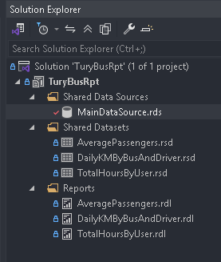
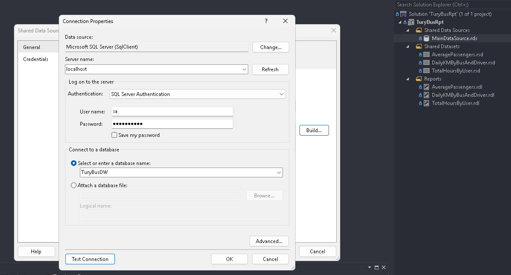
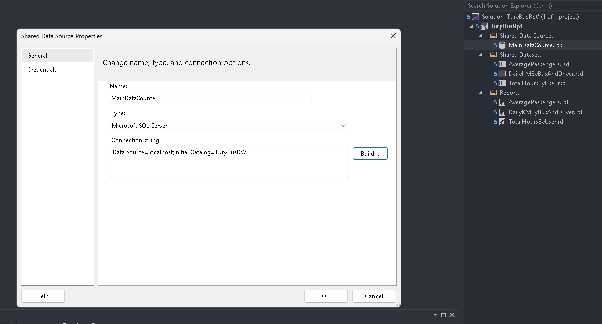
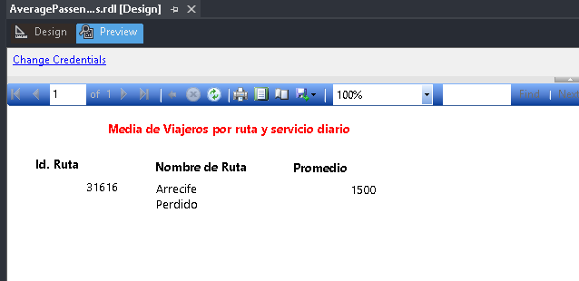
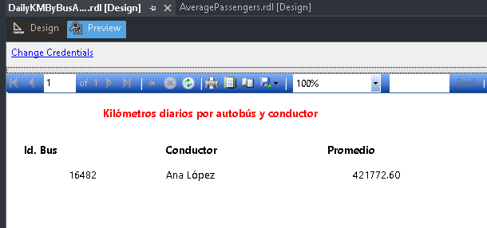
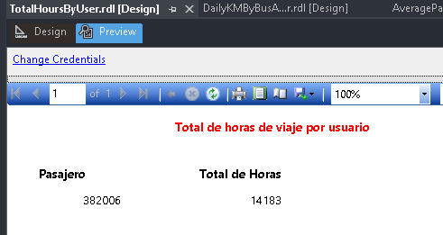

# 📄 IV. Proyecto TuryBusRpt

## 🚀 Pasos de Configuración

### Configuración en Visual Studio

1. Abra la solución `TuryBusRpt.sln`.
2. Desde el **Explorador de Soluciones**, haga clic derecho sobre el proyecto **TuryBusRpt** y seleccione `Build`.

### Configuración de `MainDataSource.rds`

1. En el **Explorador de Soluciones**, dentro de `Shared Data Sources`, haga doble clic sobre `MainDataSource.rds`.
2. Actualice los datos de conexión al servidor y base de datos local.

### Verificación de los reportes

1. Desde la sección `Reports` en el **Explorador de Soluciones**, abra y previsualice los siguientes reportes en la pestaña `Preview`:
   - **Media de viajeros por ruta y servicio diario**
   - **Kilómetros diarios por autobús y conductor**
   - **Total de horas de viaje por usuario**

[**◀ Volver al README**](README.md)